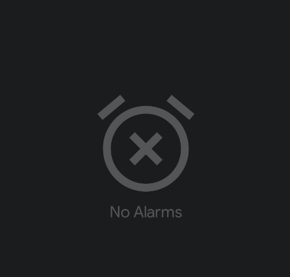

# My Reminder App

## TODO (high priority)

* A new recurrence type to allow infinite recurrence.
* Text box to show the next set of upcoming alarms.
* Add notifications for upcoming alarms. 
* Add various preferences.
* Add an option to create a daily TODO list that shows up early in the morning or as soon as the phone internet is up, or maybe some other selectable conditions.
* Add capabilities to select ringtones and sounds.

## TODO (low priority)

* Look into ,TextInputLayout, SnackBars, TabLayout (for tabs), NavigationView (for sliding screens), Coordinator layout.
* AppBarLayout, BottomAppBar
* Delete All menu item in general long-click will allow selection and deletion.
* LiveData and Observables can be used well together. We can use observables for everything else and use LiveData just at the ViewModel, since LiveData is lifecycle aware.

## Bugs

* Going below the current time doesn't change the date to tomorrow.
* Date validation doesn't work for the end date's date picker.
* Need validations to skip views in the recycler view if the fields are empty.

## Future Features

- Integrate with WhatsApp and/or SMS to send out notifications/reminders to others, as needed.
- Use something similar to  instead of the current boring text.

## App Modernization Suggestions

[x] Ensure themes use NoActionBar if you want a custom Toolbar.
[x] Remove any legacy ActionBar usage from code and layouts.
[x] Use Material Components for UI consistency.
[] Migrate deprecated APIs and libraries.
[x] Refactor code for MVVM or recommended architecture.
[] Use ViewBinding or Jetpack Compose for UI.
[] Update Gradle dependencies to latest stable versions.
[] Add runtime permissions handling if targeting Android 6.0+.
[] Use androidx libraries everywhere.
[] Optimize layouts for accessibility and responsiveness.
[] Add unit and UI tests.
[] Implement dark mode support.
[] Use Navigation Component for in-app navigation.
[] Leverage WorkManager for background tasks.
[] Integrate Firebase or other analytics tools.
[] Use Glide or Picasso for image loading.
[] Implement data persistence with Room or other databases.
[] Optimize app performance and memory usage.
[] Follow Material Design guidelines for UI/UX.
[] Use ConstraintLayout for complex layouts.
[] Implement localization for multiple languages.
[] Use Lint and static analysis tools to improve code quality.
[] Regularly update the app to fix bugs and add new features.
[] Monitor app performance with tools like Firebase Performance Monitoring.
[] Use Coroutines or RxJava for asynchronous programming.
[] Implement push notifications with Firebase Cloud Messaging.
[] Use SharedPreferences or DataStore for storing user settings.
[] Ensure proper error handling and user feedback.
[] Use vector drawables for better scalability and performance.
[] Optimize app size by removing unused resources and code.
[] Use Jetpack libraries for modern Android development.
[] Follow best practices for security and data privacy.
[] Regularly review and refactor code to maintain quality.
[] Stay updated with the latest Android development trends and best practices.
